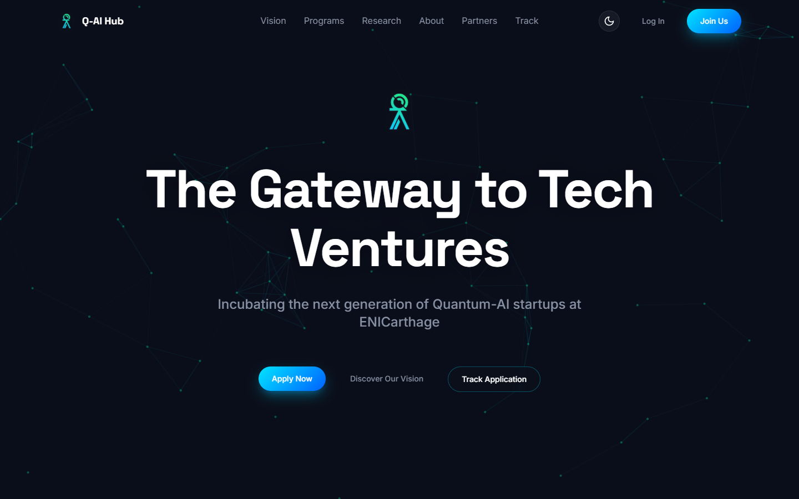
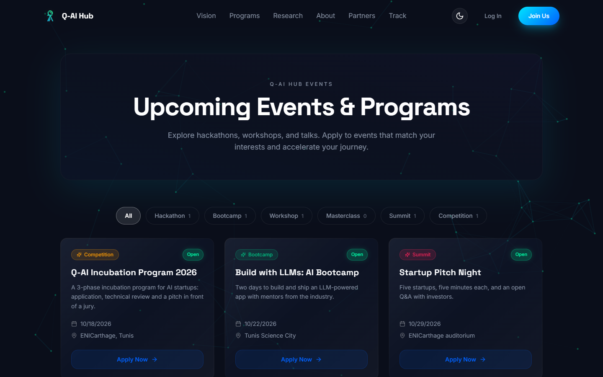
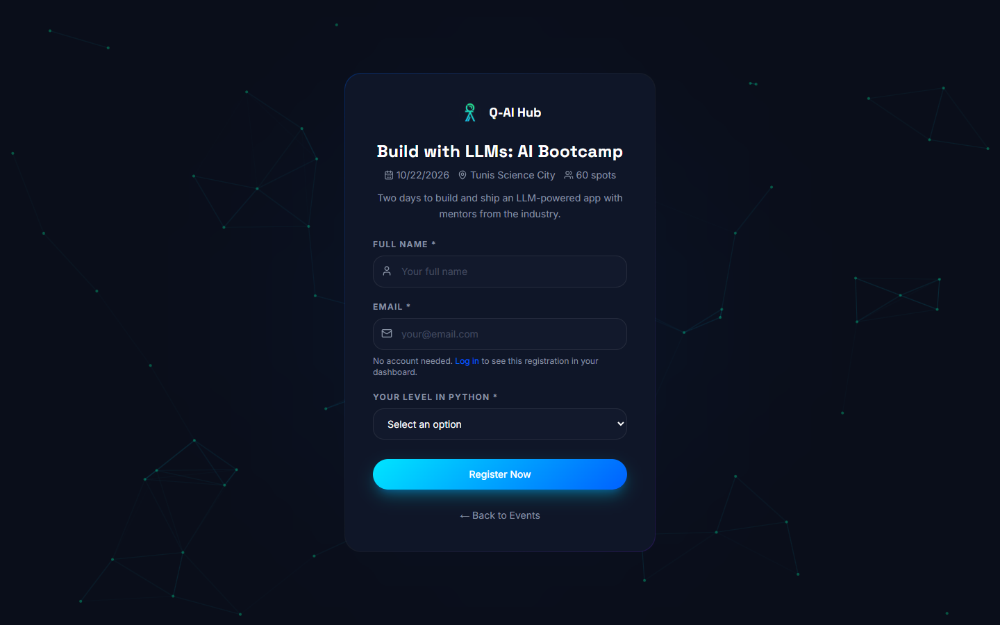
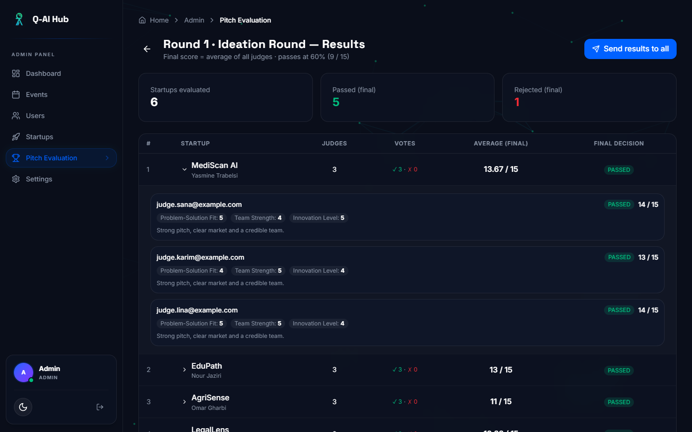
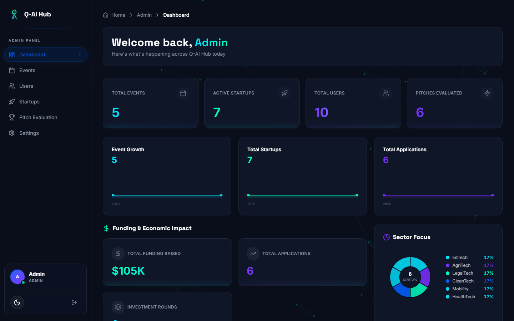
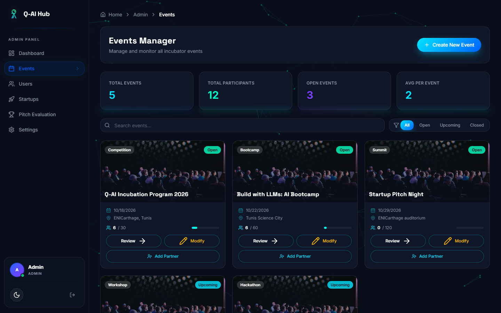
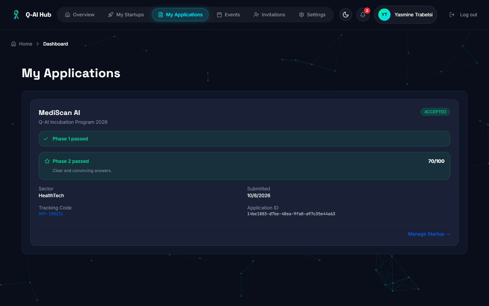
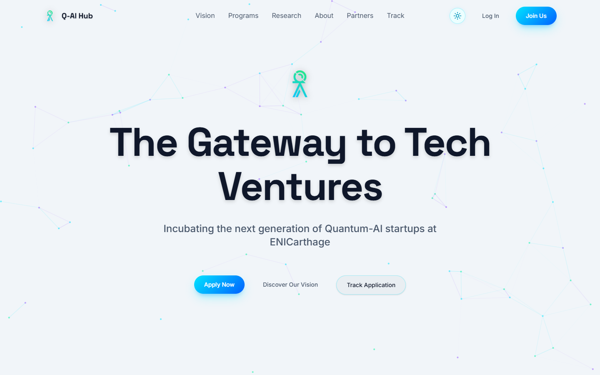
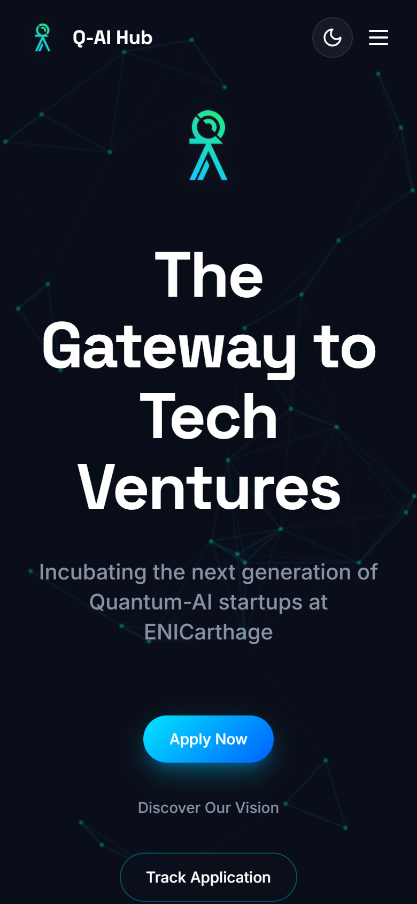
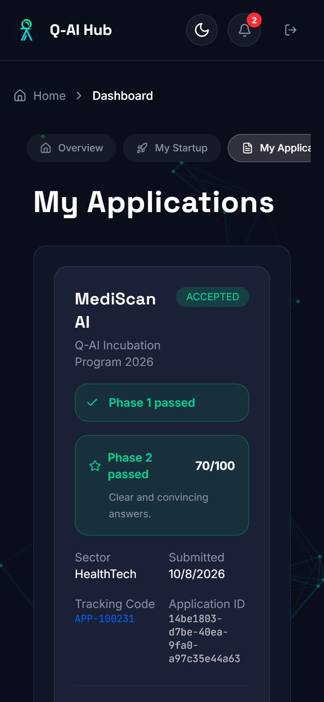

# Q-AI Hub

[](https://github.com/mmeelt/Q-AI-Hub-Platform/actions/workflows/ci.yml)


[](LICENSE)

Showcase website and management dashboard of the Q-AI Hub incubator (ENICarthage):
events and registrations, startup incubation programs (phases), multi-judge pitch evaluation,
and startup profiles. Built as a team project at ENICarthage.



## Features

- **Two kinds of events**: simple events (register with name + email, custom questions set by the admin)
  and incubation programs (apply with a startup, then go through phases)
- **Phases**: questionnaires, follow-up questions from the admin, accept / reject decisions with email notifications
- **Multi-judge pitch evaluation**: experts invited per event score each startup on the round's criteria;
  every judge scores separately, the average is the final score, and the admin sends the results to all startups
- **Startups & teams**: startup profiles, teammate invitations, pitch video upload
- **"Notify me"** on upcoming events: one email when registrations open
- **Administration**: dashboard, several administrators, platform settings, CSV exports
  (applications, jury scores, events)
- **Security**: two-step login (password + emailed code), HttpOnly cookies, rate limiting,
  per-event judge access, ownership checks, optional anonymous applicants for judges

## Screenshots

| Events | Registration to a simple event |
|---|---|
|  |  |
| **Pitch evaluation: every judge, the average and the final decision** | **Admin dashboard** |
|  |  |
| **Events manager** | **Founder: application progress** |
|  |  |
| **Light theme** | **Mobile** |
|  |   |

<sub>Screenshots use fictional demo data.</sub>

## My contributions (Meriem Eltaief)

This is a team project. My part:

- **Backend (Spring Boot)**: REST API, services and data model for events, applications,
  phases, pitch rounds and startups, with versioned database migrations (Flyway).
- **AI features (Google Gemini)**: AI refinement of startup descriptions, and AI feedback
  generated for each startup from the judges' pitch-round scores.
- **Two-step login (OTP)**: password, then a 6-digit code sent by email, with expiry and a
  limited number of attempts; the same flow protects password reset and admin login.
- **Security**: JWT kept in HttpOnly SameSite cookies with refresh-token rotation and revocation,
  rate limiting, security headers, password policy, input sanitizing, per-event judge access.
- **Emails**: asynchronous SMTP notifications for login codes, application and phase decisions,
  pitch results, expert and teammate invitations, event registrations and "notify me" alerts.
- **Frontend–backend integration**: connected the React app to the API (REST client,
  cookie session with automatic refresh, error handling).

## Tech stack

| Part | Stack |
|------|-------|
| `backend/` | Java 17 · Spring Boot 3 · Spring Security (JWT + OTP) · JPA/Hibernate · MySQL |
| `frontend/` | React 18 · TypeScript · Vite · Tailwind CSS 4 · shadcn/ui · Motion |

## Project structure

```
.
├── backend/                     Spring Boot REST API (port 8081)
│   ├── src/main/java/tn/enicarthage/backend/
│   │   ├── config/              Security, CORS, uploads, seed data (dev), scheduled jobs
│   │   ├── controller/          REST endpoints  (/api/...)
│   │   ├── dto/                 Request / response objects
│   │   ├── entity/              JPA entities
│   │   ├── exception/           Custom exceptions + global error handler
│   │   ├── repository/          Spring Data repositories
│   │   ├── security/            JWT filter, rate limiting, security headers, sanitizing
│   │   └── service/             Business logic
│   ├── src/main/resources/
│   │   ├── application.properties       shared settings (no secrets)
│   │   ├── application-dev.properties   local development defaults
│   │   └── db/migration/                Flyway SQL migrations (V1 baseline, V2 indexes...)
│   ├── src/test/                Unit + integration tests (JUnit 5, Mockito, H2)
│   ├── .env.example             template for backend/.env (secrets, gitignored)
│   ├── Dockerfile               API image (multi-stage, non-root)
│   └── pom.xml
├── frontend/                    React single-page app (port 5173)
│   ├── Dockerfile, docker/      Website image: nginx serves the build and proxies /api
│   └── src/
│       ├── main.tsx
│       ├── styles/              Tailwind + theme tokens (light / dark)
│       └── app/
│           ├── App.tsx          Routes (lazy-loaded pages)
│           ├── services/api.ts  REST client (JWT + refresh)
│           ├── pages/
│           │   ├── public/      Landing, events, track, guest event registration
│           │   ├── auth/        Login, register, OTP
│           │   ├── participant/ Dashboard (one component per tab in dashboard/), applications, startups
│           │   ├── expert/      Judge view of an event (review + pitch scoring)
│           │   └── admin/       Admin dashboard, events, users, submissions
│           ├── components/
│           │   ├── layout/      Navigation, footer, dashboard header, breadcrumbs
│           │   ├── common/      Buttons, inputs, logo, avatar, cards
│           │   ├── auth/        Route guard, login prompt
│           │   ├── theme/       Light/dark theme provider + toggle
│           │   ├── effects/     Particle background, scroll animations
│           │   ├── pitch/       Shared multi-judge pitch scoring panel
│           │   ├── admin/       Admin dashboard sections
│           │   └── ui/          shadcn/ui primitives
│           └── utils/
├── .github/workflows/ci.yml     CI: backend tests, frontend type check + build, Docker images
├── docker-compose.yml           MySQL + API + website with one command
├── database/                    SQL maintenance scripts
├── docs/                        Class diagram, design guidelines, deployment guide
└── scripts/run-dev.bat          Starts API + frontend in two windows (Windows)
```

## Quick start with Docker

The fastest way to try the platform, with nothing installed except Docker:

```bash
docker compose up --build
```

| | |
|---|---|
| Website | http://localhost:8080 |
| API documentation (Swagger UI) | http://localhost:8081/swagger-ui.html |
| Admin account | `admin@platform.com` / `Admin#Demo2026` (tick *Admin* on the login page) |
| Founder account | `test@mail.com` / `User#Demo2026` |
| Login code | `123456` (no email server in this setup) |

These demo values are for local use only. Override them, or change the ports if 8080 / 8081
are taken, in a `.env` file next to `docker-compose.yml` (see `.env.example`).
`docker compose down -v` removes the containers and the demo database.

## Getting started without Docker

Prerequisites: JDK 17+, Node.js 18+, MySQL 8 running on `localhost:3306`.

1. **Configure the API**: copy `backend/.env.example` to `backend/.env` and set at least
   `DB_PASSWORD` (your MySQL password) and `JWT_SECRET` (`openssl rand -base64 64`).
   Login codes are sent by email: fill the `MAIL_*` values, or, for a quick local try only,
   set `OTP_FIXED_ENABLED=true` and an `OTP_FIXED_CODE`.
2. **Start everything**: double-click `scripts/run-dev.bat`, or run manually:
   ```bash
   cd backend  && ./mvnw spring-boot:run      # API  → http://localhost:8081
   cd frontend && npm install && npm run dev  # Web  → http://localhost:5173
   ```
   The API must be started **from the `backend/` folder** so it finds `backend/.env` and `backend/uploads/`.
3. On a brand-new database the `dev` profile creates demo accounts (`admin@platform.com`,
   `test@mail.com`) and a demo event. Their passwords come from `SEED_ADMIN_PASSWORD` /
   `SEED_USER_PASSWORD`, or are generated and printed once in the API log.
   Never deploy with the `dev` profile.

## Configuration

All secrets come from environment variables or `backend/.env`:

| Variable | Required | Purpose |
|----------|----------|---------|
| `SPRING_PROFILES_ACTIVE` | | `dev` (default) or `prod` |
| `DB_URL`, `DB_USERNAME`, `DB_PASSWORD` | prod | MySQL connection (dev has local defaults except the password) |
| `JWT_SECRET` | prod | ≥ 64 random characters (`openssl rand -base64 64`) |
| `FRONTEND_URL` / `CORS_ALLOWED_ORIGINS` | prod | Site URL for CORS and email links |
| `MAIL_*` | for real OTP | SMTP account used to send codes and notifications |
| `GEMINI_API_KEY` | | AI feedback / description refinement |
| `OTP_FIXED_ENABLED`, `OTP_FIXED_CODE` | local only | Fixed login code instead of emails (never on a real server) |
| `SEED_ADMIN_PASSWORD`, `SEED_USER_PASSWORD` | | Passwords of the demo accounts created by the `dev` profile |
| `COOKIE_SECURE` | | `true` (default) = session cookies only over HTTPS; dev uses `false` |
| `FLYWAY_ENABLED` | | `true` (default) runs the database migrations at startup |
| `API_DOCS_ENABLED` | | Swagger UI and `/v3/api-docs`: on in `dev`, off by default otherwise |

In `prod`, `spring.jpa.hibernate.ddl-auto` defaults to `validate`: apply schema changes with
migration scripts instead of letting Hibernate alter the production database.

## API documentation

The API is described with OpenAPI. With the `dev` profile (or `API_DOCS_ENABLED=true`), open
**http://localhost:8081/swagger-ui.html** to browse every endpoint grouped by feature and try them:
log in with `POST /api/auth/login` and `POST /api/auth/verify-otp`, and the session cookie is
then sent with the next requests. The raw spec is at `/v3/api-docs`.

## Tests and quality checks

```bash
cd backend && ./mvnw test           # 151 tests: services, controllers, security filters, multi-judge scoring
cd frontend && npm run typecheck    # TypeScript in strict mode
cd frontend && npm run build        # production build (Vite)
```

[GitHub Actions](.github/workflows/ci.yml) runs all of them, and builds the Docker images,
on every push and pull request.

## Database migrations (Flyway)

Schema changes are versioned SQL files in `backend/src/main/resources/db/migration`, applied
automatically at startup.

- A database created earlier by Hibernate is recorded as version 1 (baseline) and only later
  scripts run on it.
- To change the schema, add a new file: `V7__short_description.sql`. **Never edit an applied migration.**
- `dev` still lets Hibernate add new columns (`ddl-auto=update`); `prod` only validates the schema.

## Authentication

Login is two-step (password, then a 6-digit code sent by email). The API then sets two
**HttpOnly, SameSite=Strict cookies**: `qa_access` (1 h, sent to `/api`) and `qa_refresh`
(7 days, only sent to `/api/auth`). JavaScript never sees the tokens; the frontend renews the
session automatically on `401`. API clients (Postman, scripts) may still send
`Authorization: Bearer <token>`. In production keep `COOKIE_SECURE=true` (HTTPS only).

## Production build

```bash
cd frontend && npm run build          # static files in frontend/dist
cd backend  && ./mvnw clean package   # backend/target/*.jar
```
Serve `frontend/dist` and reverse-proxy `/api` and `/uploads` to the API on the same domain.
See [docs/DEPLOYMENT.md](docs/DEPLOYMENT.md) for a step-by-step deployment on free hosting.

## Roles

- **Visitor** – browses events, registers to simple events with name + email.
- **Participant** – applies to incubation events with a startup, follows phases and results.
- **Expert / judge** – invited by an admin to an event; reviews startups and scores pitches.
- **Admin** – manages events, phases, users and startups; sees every judge's scores and
  sends the averaged results.

## Team

Team project built at ENICarthage by:

- **Meriem Eltaief**
- **Maram Bouchrit**
- **Bacem Sakji**

## License

[MIT](LICENSE)
